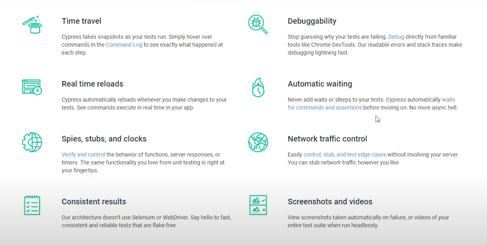
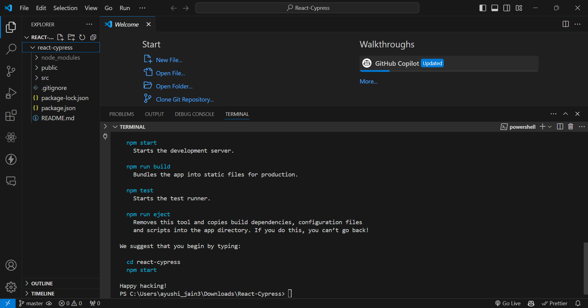
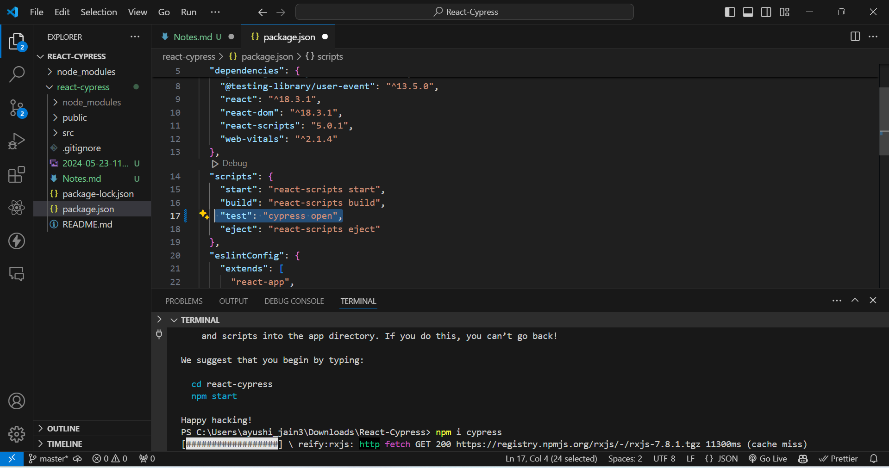
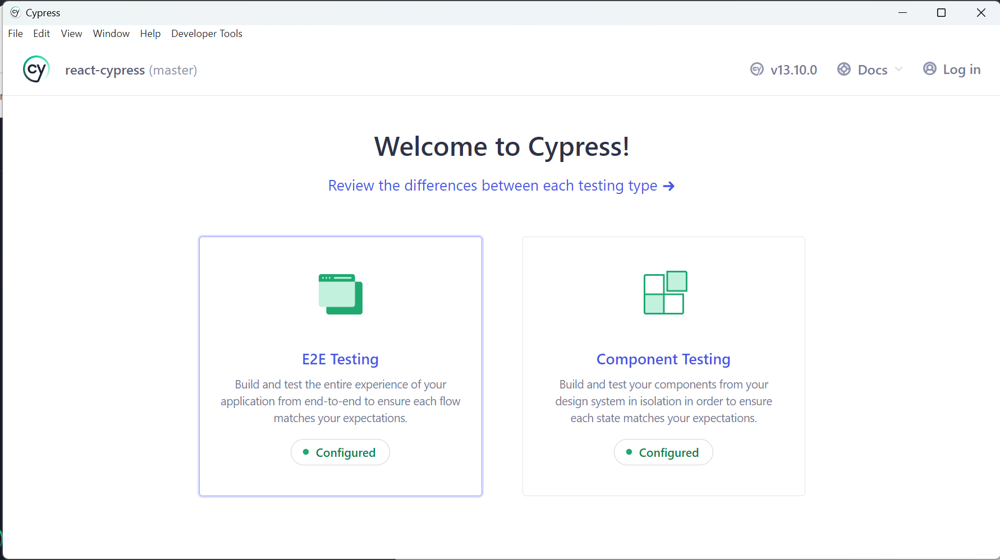
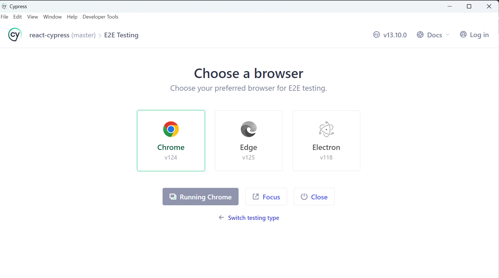
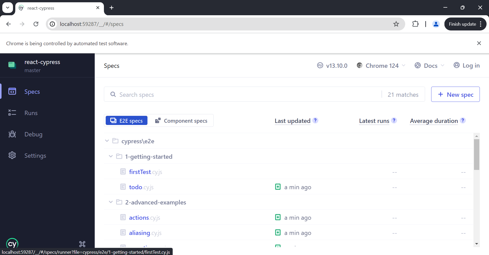
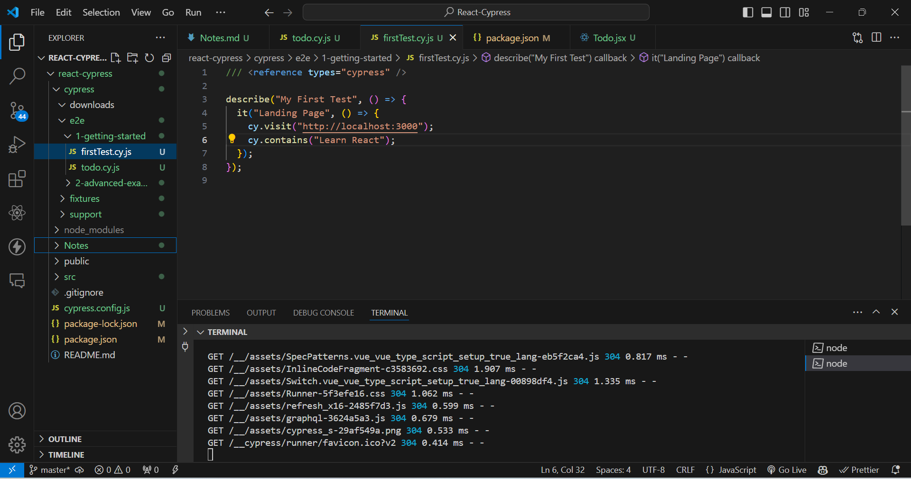
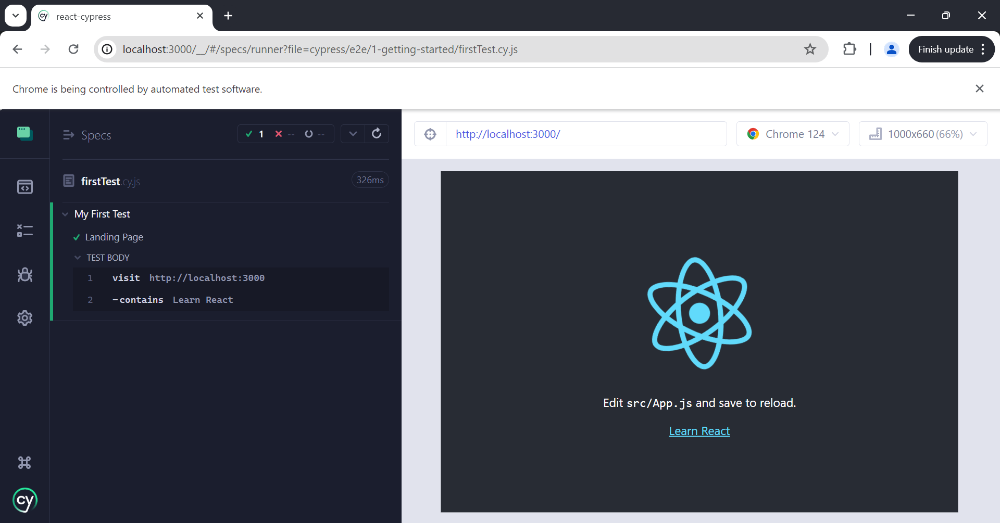
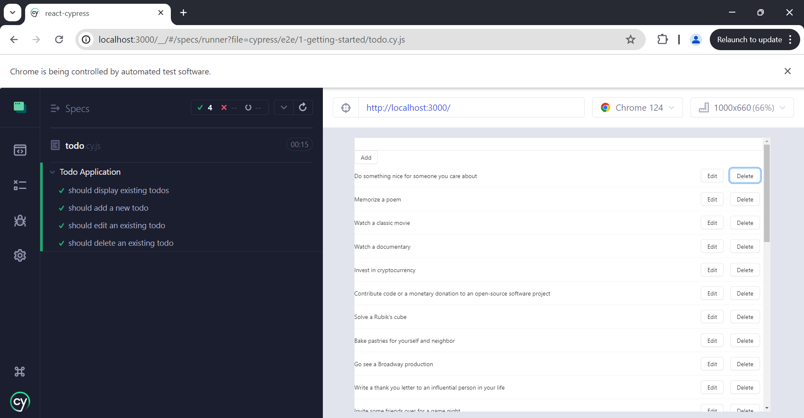

> ## Introduction

#### Why Cypress?

- In very simple words :

  - Let's say you added a button which changes some content onClick of it.
  - Now you will check at your end the places it could affect.
  - After checking at your end you pushed the code!
  - But it _Broke the code!_ at the place you weren't aware, that it would get updated.
  - Now you are stuck - about how to make sure that you have fully checked the functionalities
  - Here comes to rescue - `Cypress : An automation testing`
  - One time hardwork : What is now required is to cover entire codebase functionalities with test cases
  - From next time as you update any functionality : Just run these cases and get to know if anything is affected.
  - In place of checking everything yourself, now cypress will do it for you! With least chances of missing something out!

- Cypress runner runs inside our web app and can inject code using javascript as it shares the same origin

#### Features of Cypress



- Distinguish features are :-

1. Snapshots to see what happened at each step
2. Automatic waiting
3. Easy debugging

## Installation

1. Require node
2. Create a react project
   
3. Install Cypress package `npm install cypress --save-dev`
4. Add Cypress open command in the package.json
   
5. Open the cypress `npm run test`
   - Select E2E Testing option
     
   - Choose your favorite browser
     
   - You can see all the default files - Select your file name to start running
     

## Cypress Folder Structure

Let us understand the folder structure in Cypress. The factors that are included in a
Cypress folder are explained below:

- `fixtures`: Test data in form of key-value pairs for the tests are maintained here.
- `e2e` : Test cases for the framework are maintained here and is used for _comprehensive user journey tests across the entire application_.
- `integration`: Test cases for the framework are maintained here and is used for _testing specific parts or features interacting within the application_.
- `plugins`: Cypress events (prior and post events to be executed for a test) are maintained here.
- `support`: Reusable methods or customized commands, which can be utilised by testcases directly, without object creation are created here.
- `videos`: Executed test steps are recorded in the form of videos and maintained here.
- `node_modules`: Project dependencies from the npm are maintained in this folder. It is the heart of the Cypress project execution.
- `cypress`.json: Default configurations are set in this folder. The values of the current configurations can be modified here, which overrules the default configurations.
- `package.json`: Dependencies and scripts for the projects are maintained in this folder.

## First Test : Default React Page

- Create a file with `.cy.js` extension in the e2e folder in the cypress folder
  

#### Structure of basic test

1. Test suite name has to be provided within the describe function.
2. Test case names within a test suite have to be provided within the same or you have to specify the function.
3. Test steps within a test case have to be implemented inside the it/specify block.

```js
describe("My First Test", () => {
  it("Landing Page", () => {
    cy.visit("http://localhost:3000");
    cy.contains("Learn React");
  });
});
```

- Select your file name to start running
  
  _Congratulations!_
  

---

## Let's dive deep

### Element Selectors

1. `cy.get('button').click()` _Never Worst_ : Too generic, no context.
2. `cy.get('.btn.btn-large').click()` _Never Bad_ : Coupled to styling. Highly subject to change.
3. `cy.get('#main').click()` _Sparingly Better_ : But still coupled to styling or JS event listeners.
4. `cy.get('[name="submission"]').click()` _Sparingly_ : Coupled to the name attribute which has HTML semantics.
5. `cy.contains('Submit').click()` _Depends Much better_ : But still coupled to text content that may change.
6. `cy.get('[data-cy="submit"]').click()` **Always Best** :Isolated from all changes.

### Basic Constructs of Cypress :-

#### describe():

This method is used to group related test cases. It takes two arguments: a string that describes the group of test cases and a callback function that contains the individual test cases.

#### it():

This method is used to define a test case. It takes two arguments: a string that describes the test case and a callback function that contains the actual test code

#### before():

This method is used to run a setup function before any test case in a particularly described block. It can be used to set up the test environment, initialize variables, and perform other setup tasks.

#### after():

This method is used to run a cleanup function after all the test cases in a particularly described block have finished running. It can be used to clean up the test environment, close open connections, and perform other cleanup tasks.

#### beforeEach():

This method is used to run a setup function before each test case in a particularly described block. It can be used to reset the state of the test environment and perform other setup tasks.

#### afterEach():

This method is used to run a cleanup function after each test case in a particularly described block has finished running. It can be used to reset the state of the test environment and perform other cleanup tasks.

#### .skip():

When dealing with a large codebase and wanting to concentrate on specific tests or subsets of tests, the .skip() function provides a handy means to temporarily prevent certain tests from being executed.

## Cypress Basic Commands

#### and

It is used to create an assertion and is an alias of .should ().

```js
//element is visible & enabled
cy.get("#txt").should("be.visible").and("be.enabled");
//element is checked
cy.contains("Subject").and("be.checked");
```

#### as

It provides an alias for later usage.

```js
//alias element as parent
cy.get("#txt").find("li").first().as("parent");
```

#### blur

It blurs an element in focus.

```js
//blur input
cy.get("#txt").type("abc").blur();
```

#### check

It checks radio buttons or checkboxes and is applied to elements having input tags.

```js
//checks element having class attribute chkbox
cy.get(".chkbox").check();
```

#### children

It obtains the sub elements of an element.

```js
//obtains children of element n
cy.get("n").children();
```

#### clear

It removes the value from textarea or input.

```js
//removes input abc
cy.get("#txt").type("abc").clear();
```

#### clearCookie

It removes a particular browser cookie.

```js
//clear abc cookie
cy.clearCookie("abc");
```

#### clearCookies

It removes the browser cookies from an existing domain and subdomain.

```js
//clear all cookies
cy.clearCookies();
```

#### clearLocalStorage

It removes the local Storage data from an existing domain and subdomain.

```js
//clear all local storage
cy.clearLocalStorage();
```

#### click

It clicks an element in Document Object Model (DOM).

```js
//click on element with id txt
cy.get("#txt").click();
```

#### contains

It obtains an element having a specific text. The element can have more than the text and still match.

```js
//returns element in #txt having Tutor text
cy.get("#txt").contains("Tutor");
```

#### dblclick

It double-clicks an element in Document Object Model (DOM).

```js
//double clicks element with id txt
cy.get("#txt").dblclick();
```

#### debug

It fixes a debugger and log values are returned by prior command.

```js
//pause to debug at start of command
cy.get("#txt").debug();
```

#### document

It obtains window.document on the active page.

```js
cy.document();
```

#### each

It iterates through an array having the property length.

```js
//iterate through individual li
cy.get('li').each(() => {...})
```

#### end

It ends a command chain.

```js
//obtain null instead of input
cy.contains("input").end();
```

#### eq

It refers to an element at a particular index in an array of elements.

```js
//obtain third td in tr
cy.get("tr>td").eq(2);
```

#### exec

It runs a system command.

```js
cy.exec("npm init");
```

#### find

It obtains the descendant elements of a particular locator.

```js
//obtain td from tr
cy.get("tr").find("td");
```

#### first

It obtains the first element from a group of elements.

```js
//obtain first td in tr
cy.get("tr>td").first();
```

#### get

It obtains single or multiple elements by locator.
It obtains the descendant elements of a particular locator.

```js
//obtain all td from tr in list
cy.get("tr>td");
```

#### getCookie

It obtains a particular browser cookie by its name.

```js
cy.getCookie("abc");
```

#### getCookies

It obtains all the cookies

```js
cy.getCookies();
```

#### go

It moves forward or backward to the next or previous URL in browser history.

```js
//like clicking back button
cy.go("back");
//like clicking forward button
cy.go("forward");
```

#### visit

It launches an URL.

```js
cy.visit("https://www.tutorialspoint.com/index.htm");
```

#### next

It obtains the immediate sibling of an element within a group of elements in Document
Object Model (DOM).

```js
//gives the following link in element l.
cy.get("l a:first").next();
```

#### parent

It obtains the parent element from a group of elements in DOM.

```js
//get parent of element with class h
cy.get(".h").parent();
```

#### should

It is used to create an assertion and is an alias of .and ().

```js
//assert element is visible & enabled
cy.get("#txt").should("be.visible").and("be.enabled");
```

#### wait

Wait for a certain time in milliseconds or for an aliased element prior to moving the following step.

```js
cy.wait(1000);
```

#### title

It obtains the document.title of the active page.

```js
cy.title();
```

#### viewport

It manages the dimension and positioning of the screen.

```js
// viewport to 100px and 500px
cy.viewport(100, 500);
```

#### log

It prints the messages to the Command Log.

```js
cy.log("Cypress logging ");
```

#### reload

It is used for page reloading.

```js
cy.reload();
```

---

## Example : Todo App Code

- Let's create cypress test for the following code
- It has 4 major functionalities
  1. List todos
  2. Add a new todo
  3. Edit a todo
  4. Delete a todo
- This implies we will need 4 tests

```js
import React, { useState, useEffect } from "react";
import { Button, Checkbox, Input, List } from "antd";
import axios from "axios";
import "antd";

const Todo = () => {
  const [todos, setTodos] = useState([]);
  const [newTodo, setNewTodo] = useState("");

  useEffect(() => {
    axios.get("https://dummyjson.com/todos").then((response) => {
      setTodos(response.data.todos);
    });
  }, []);

  const handleEdit = (index) => {
    const todo = todos[index];
    const updatedTodo = prompt("Edit todo:", todo.todo);

    if (updatedTodo) {
      const newTodos = [...todos];
      newTodos[index] = { ...todo, todo: updatedTodo };
      setTodos(newTodos);
    }
  };

  const handleDelete = (index) => {
    const newTodos = todos.filter((_, i) => i !== index);
    setTodos(newTodos);
  };

  const handleAdd = () => {
    if (newTodo) {
      const newTodos = [{ todo: newTodo, completed: false }, ...todos];
      setTodos(newTodos);
      setNewTodo("");
    }
  };

  return (
    <div>
      <Input
        value={newTodo}
        onChange={(e) => setNewTodo(e.target.value)}
        onPressEnter={handleAdd}
      />
      <Button onClick={handleAdd}>Add</Button>
      <List
        dataSource={todos}
        renderItem={(todo, index) => (
          <List.Item
            actions={[
              <Button onClick={() => handleEdit(index)}>Edit</Button>,
              <Button onClick={() => handleDelete(index)}>Delete</Button>,
            ]}
          >
            <span>{todo.todo}</span>
          </List.Item>
        )}
      />
    </div>
  );
};

export default Todo;
```

## Cypress Test for Todo

- Let us now apply all the concepts in our todo test cases.
- `Setup with beforeEach`: Ensures the application is in a consistent state before each test by visiting the base URL.
- `Display Existing Todos`:
  - Uses cy.request to fetch todos from an external API and verifies the response status.
  - Checks if the list container exists and the number of items matches the fetched data.
- `Add a New Todo`:
  Simulates user input to add a new todo and verifies if it appears as the first item in the list.
- `Edit an Existing Todo`:
  Simulates clicking the edit button, stubbing the prompt to simulate user input, and verifying the change.
- `Delete an Existing Todo`:
  Records the initial number of todos, simulates deleting the first item, and verifies the count is reduced by one.
- Thus, this script demonstrates typical end-to-end testing scenarios for a Todo application using Cypress, including interaction with elements and validating the application's behavior in response to user actions.
- Comments are added before each line for better explanation.

```js
// cypress/e2e/todo.cy.js

// Describe block to group related tests for the "Todo Application"
describe("Todo Application", () => {
  // beforeEach hook to run setup code before each test
  beforeEach(() => {
    // Visit the application URL before each test
    cy.visit("http://localhost:3000");
    // Note: Adjust the URL according to your development server
  });

  // Test to verify that existing todos are displayed correctly
  it("should display existing todos", () => {
    // Fetch todos from an external API and check the response
    cy.request("https://dummyjson.com/todos").then((response) => {
      // Ensure the response status is 200 (OK)
      expect(response.status).to.eq(200);
      // Extract todos from the response body
      const todos = response.body.todos;

      // Check if the list container exists in the DOM
      cy.get(".ant-list-items").should("exist");

      // Verify the number of displayed todos matches the fetched data
      cy.get(".ant-list-item").should("have.length", todos.length);
    });
  });

  // Test to verify adding a new todo
  it("should add a new todo", () => {
    const newTodoText = "New Cypress Todo";

    // Type new todo text in the input field and press Enter
    cy.get("input").type(newTodoText).type("{enter}");

    // Verify the new todo is added as the first item in the list
    cy.get(".ant-list-item").first().should("contain.text", newTodoText);
  });

  // Test to verify editing an existing todo
  it("should edit an existing todo", () => {
    const editedTodoText = "Edited Cypress Todo";

    // Edit the first todo in the list
    cy.get(".ant-list-item")
      .first()
      .within(() => {
        // Click the Edit button of the first todo
        cy.contains("Edit").click();
      });

    // Simulate user input in the prompt dialog for editing
    cy.window().then((win) => {
      // Stub the prompt to return the edited text
      cy.stub(win, "prompt").returns(editedTodoText);
    });

    // Confirm the edit action by clicking the Edit button again
    cy.get(".ant-list-item").first().contains("Edit").click();

    // Verify the edited todo text is displayed correctly
    cy.get(".ant-list-item").first().should("contain.text", editedTodoText);
  });

  // Test to verify deleting an existing todo
  it("should delete an existing todo", () => {
    // Get the initial number of todos in the list
    cy.get(".ant-list-item").then((initialItems) => {
      const initialLength = initialItems.length;

      // Delete the first todo in the list
      cy.get(".ant-list-item")
        .first()
        .within(() => {
          // Click the Delete button of the first todo
          cy.contains("Delete").click();
        });

      // Get the updated number of todos in the list
      cy.get(".ant-list-item").then((updatedItems) => {
        const updatedLength = updatedItems.length;

        // Verify the number of todos is reduced by one
        expect(updatedLength).to.equal(initialLength - 1);
      });
    });
  });
});
```

- Cypress Window Result



---
